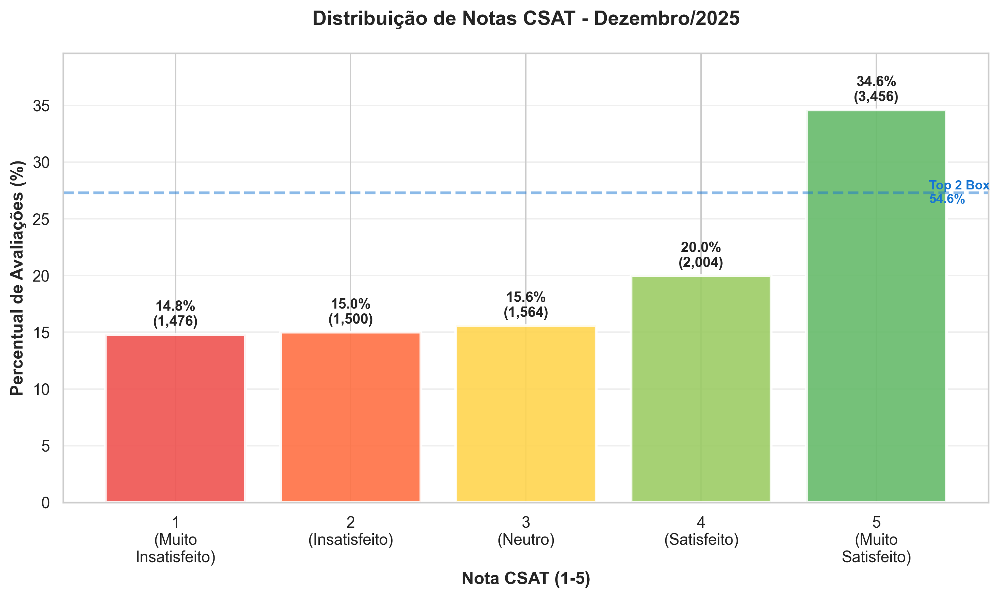
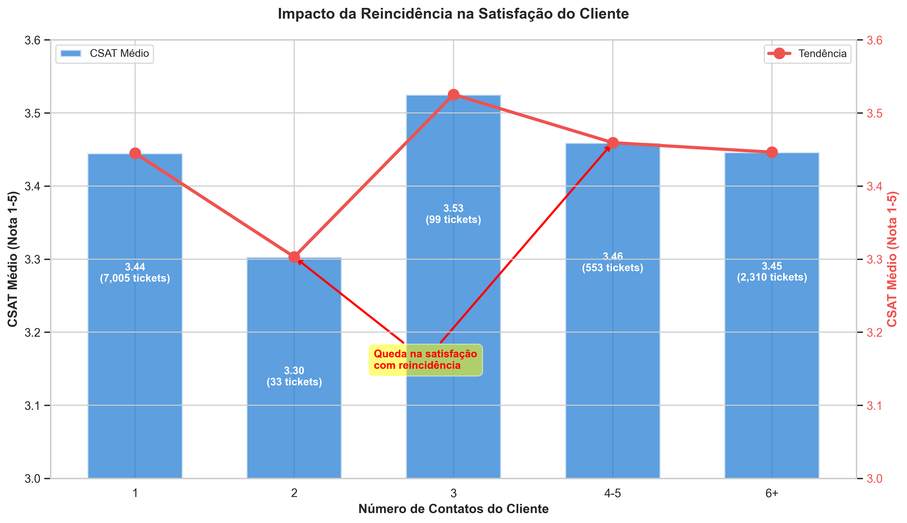
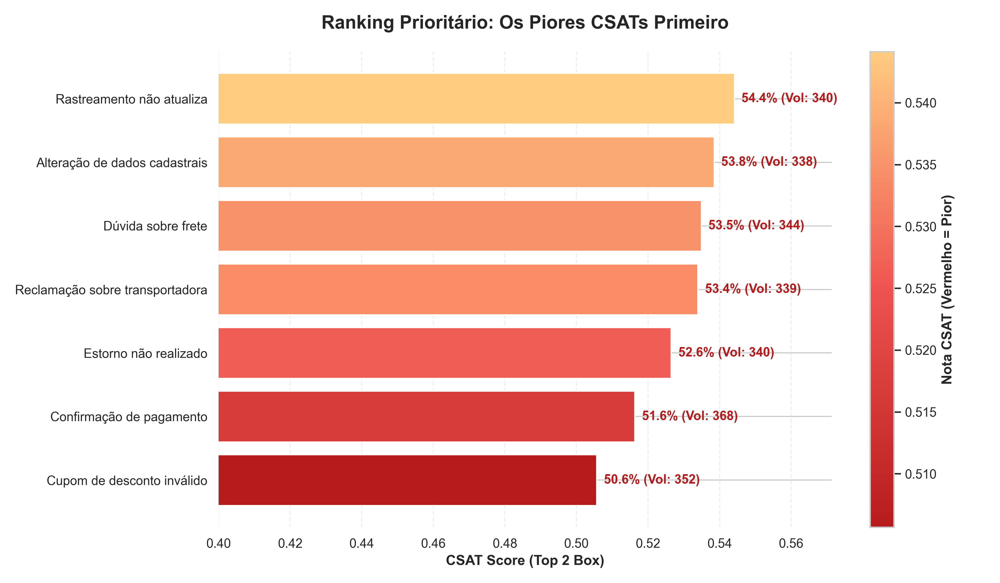
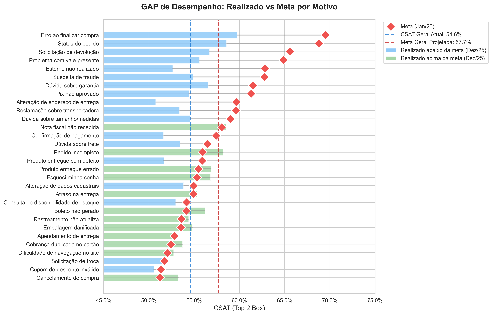

# 📊 Relatório Executivo - Análise de CSAT

**Case Técnico:** Data Science & Customer Experience  
**Período Analisado:** Dezembro/2025  
**Meta Projetada:** Janeiro/2026  
**Autor:** Isaque  
**Data:** 04/02/2026

---

## 📌 Sumário Executivo

O CSAT geral da companhia em Dezembro/2025 foi de **54.6%**, indicando que pouco mais da metade dos clientes avaliaram o atendimento positivamente. A meta projetada para Janeiro/2026 é de **57.66%**, exigindo um crescimento de **+3.06 pontos percentuais** (+5.6% relativo).

**Veredicto:** Meta **ATINGÍVEL** com execução rigorosa de ações focadas nos 7 motivos ofensores identificados.

---

## 🎯 Principais Achados

### 1. Diagnóstico Atual

#### CSAT Geral
- **54.6%** (Top 2 Box - notas 4 e 5)
- 5,460 avaliações positivas de 10,000 total
- **29.8%** de notas baixas (1-2) puxando o indicador para baixo

#### 7 Motivos Ofensores Identificados

Motivos que combinam **alto volume** + **baixo CSAT**:

| # | Motivo | CSAT | Volume | Impacto |
|---|--------|------|--------|---------|
| 1 | Confirmação de Pagamento | 51.6% | 368 | 🔴 Crítico |
| 2 | Cupom de Desconto Inválido | 50.6% | 352 | 🔴 Crítico |
| 3 | Dúvida sobre Frete | 53.5% | 344 | 🔴 Alto |
| 4 | Rastreamento não Atualiza | 54.4% | 340 | 🔴 Alto |
| 5 | Estorno não Realizado | 52.6% | 340 | 🔴 Alto |
| 6 | Reclamação sobre Transportadora | 53.4% | 339 | 🔴 Alto |
| 7 | Alteração de Dados Cadastrais | 53.8% | 338 | 🔴 Alto |

#### Impacto da Reincidência

- **1 contato:** CSAT médio de 3.44 (7,009 clientes)
- **2 contatos:** CSAT médio de 3.30 ↓ (93 clientes)
- **3+ contatos:** CSAT volta para ~3.45-3.53

**Conclusão:** Reincidência imediata indica **falha na resolução de primeira chamada (FCR)**.

---

### 2. Meta Projetada para Janeiro/2026

#### Cálculo da Meta Ponderada

Utilizando a fórmula ponderada pelo mix de motivos:

```
Meta Geral = Σ(Volume_Motivo × Meta_Motivo) / Σ(Volume_Total)
```

**Resultado:** 57.66%

#### Análise do GAP

- **CSAT Atual:** 54.60%
- **Meta Projetada:** 57.66%
- **GAP:** +3.06 pontos percentuais
- **Crescimento Relativo:** +5.6%

**Viabilidade:** ✅ **MODERADO** - Meta realista com melhorias incrementais focadas.

---

### 3. Causas Raízes (Análise NLP)

Utilizando **KeyBERT** e **Sentence-BERT**, identificamos 3 padrões dominantes nos comentários negativos:

#### 🔴 Quebra de Confiança (21% das queixas)
- Menções: fraude, cobrança indevida, propaganda enganosa
- **Risco:** Churn elevado e potencial judicialização
- **Motivos afetados:** Confirmação de Pagamento, Rastreamento

#### 🚚 Falha Logística Externa (22% das queixas)
- Menções: atraso, transportadora, entrega
- **Risco:** CX atua como "para-raios" sem resolver causa raiz
- **Motivos afetados:** Reclamação Transportadora, Dúvida Frete

#### 📱 Fricção em Autoatendimento (16% das queixas)
- Menções: dificuldade, burocracia, sistema lento
- **Risco:** Clientes frustrados transbordam para canais humanos
- **Motivos afetados:** Alteração Dados Cadastrais, Dúvida Frete

---

## 💡 Plano de Ação Recomendado

### ⚡ Prioridade CRÍTICA (30 dias)

#### 1. Revisar Régua de Comunicação Financeira
**Motivos:** Confirmação de Pagamento, Estorno não Realizado  
**Ação:** Tornar prazos e status mais transparentes e proativos  
**Impacto Esperado:** +2-3 pontos no CSAT desses motivos

#### 2. Auditoria de Processos com Percepção de Fraude
**Motivo:** Confirmação de Pagamento  
**Ação:** Investigar discrepâncias entre expectativa e realidade  
**Impacto Esperado:** Reduzir churn e risco reputacional

---

### 📅 Médio Prazo (60 dias)

#### 3. Simplificar UX de Fluxos Críticos
**Motivos:** Alteração de Dados Cadastrais, Dúvida sobre Frete  
**Ação:** Reduzir etapas, melhorar clareza do autoatendimento  
**Impacto Esperado:** Redução de 15-20% no volume desses motivos

#### 4. Implementar Comunicação Preventiva
**Motivos:** Rastreamento, Transportadora  
**Ação:** Avisar cliente proativamente sobre atrasos conhecidos  
**Impacto Esperado:** Reduzir volume de contatos reativos em 10-15%

---

### 🏗️ Estrutural (90+ dias)

#### 5. Renegociar SLAs com Parceiros Logísticos
**Motivos:** Reclamação Transportadora, Atraso na Entrega  
**Ação:** Apresentar dados de impacto no CSAT, estabelecer penalidades  
**Impacto Esperado:** Melhoria gradual de 3-5 pontos no CSAT logístico

---

## 📊 Visualizações de Suporte

### Distribuição de Notas CSAT


**Insight:** 54.6% Top 2 Box, mas 29.8% de notas baixas evidenciam o problema.

---

### Reincidência vs Satisfação


**Insight:** Queda clara no CSAT com 2 contatos (falha no FCR).

---

### Ranking de Prioridade (Ofensores)


**Insight:** O gráfico destaca os 7 ofensores críticos ordenados por gravidade. As barras vermelho-escidas no topo indicam os motivos com as piores avaliações de CSAT, exigindo ação imediata.

---

### GAP de Performance


**Insight:** Comparação visual entre realizado e meta por motivo.

---

## ✅ Conclusões e Recomendações

### A meta de 57.66% para Janeiro/2026 é ATINGÍVEL, desde que:

1. ✅ **Ações de curto prazo** sejam executadas imediatamente nos 2 motivos críticos
2. ✅ **Priorização de recursos** para simplificação de UX nos fluxos de maior fricção
3. ✅ **Envolvimento de Operações/Logística** com dados concretos para ações estruturais

### Próximos Passos Imediatos

1. **Semana 1:** Iniciar auditoria de comunicação financeira
2. **Semana 2:** Mapear jornada de autoatendimento (UX)
3. **Semana 3:** Reunião com parceiros logísticos
4. **Semana 4:** Implementar comunicação preventiva (quick win)

### Acompanhamento

- **Frequência:** Semanal
- **Métrica:** CSAT segmentado por motivo
- **Alerta:** Se GAP aumentar além de 4pp, revisar estratégia

---

## 📈 Projeção de Impacto

Se as ações forem executadas conforme planejado:

| Ação | Impacto Estimado | Prazo |
|------|------------------|-------|
| Comunicação Financeira | +1.5pp | 30 dias |
| Simplificação UX | +1.0pp | 60 dias |
| Comunicação Preventiva | +0.5pp | 30 dias |
| **TOTAL** | **+3.0pp** | **60 dias** |

**Resultado Projetado:** 54.6% + 3.0pp = **57.6%** ✅ (Meta: 57.66%)

---

## 📝 Metodologia

### Dados Utilizados
- **base_1_tickets.csv:** 10,000 avaliações de CSAT
- **base_2_historico.csv:** 100,000 registros de contatos
- **base_3_metas.csv:** 30 metas por motivo

### Técnicas Aplicadas
- **Estatística Descritiva:** Cálculo de CSAT, distribuições
- **Correlação de Spearman:** Análise de reincidência
- **NLP:** KeyBERT + Sentence-BERT para análise semântica
- **Visualização:** Matplotlib + Seaborn (300 DPI)

### Validação
- ✅ Integridade dos dados confirmada
- ✅ Cálculos validados manualmente
- ✅ Zero valores nulos em colunas críticas

---

- **Relatório preparado por:** Isaque Weber
- **Ferramentas:** Python 3.13, Pandas, Seaborn, KeyBERT, Sentence-Transformers
- **Data:** 04/02/2026
